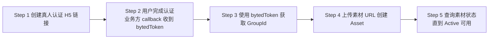

# 火山方舟模型接入指南

## 概览

OneLinkAI 提供火山方舟平台兼容接口，用于在 OneLinkAI 网关下调用火山方舟的视频生成与图片生成能力。整体目标是尽可能兼容火山方舟官方协议，方便已经接入火山方舟官方接口的业务快速迁移或并行接入。

当前这组兼容接口仅覆盖以下能力：

- 视频生成 API：创建视频生成任务 API、查询视频生成任务 API
- 图片生成 API：图片生成 API

## 接入规则

### 鉴权方式

调用 OneLinkAI 的火山方舟平台兼容接口时，统一使用 Bearer Token 鉴权：

```http
Authorization: Bearer <ApiKey>
```

### 路径规则

在 OneLinkAI 中，火山方舟兼容接口统一挂载在 `/volc/api/v3` 前缀下。

示例：

- 官方路径：`/api/v3/contents/generations/tasks`
- OneLinkAI 路径：`/volc/api/v3/contents/generations/tasks`

- 官方路径：`/api/v3/images/generations`
- OneLinkAI 路径：`/volc/api/v3/images/generations`

也就是说，如果你已经接入过火山方舟官方接口，通常只需要：

1. 将请求地址替换为 OneLinkAI 对应兼容地址。
2. 将鉴权方式统一为 OneLinkAI 的 `Authorization: Bearer <ApiKey>`。
3. 按照当前支持范围继续使用原有请求体结构进行联调。

### 通用调用方式

- 视频生成接口为异步接口，创建成功后通常返回任务 ID `id`，再通过查询接口获取最终状态与结果。
- 图片生成接口按官方协议返回图片结果；当 `response_format=url` 时，返回的结果链接存在有效期，建议业务侧及时转存。
- 请求体字段与响应体结构按火山方舟官方文档整理，OneLinkAI 保留统一鉴权与网关路径。

## 能力清单

以下内容用于快速说明 OneLinkAI 对火山方舟官方能力的当前支持范围。实际调用时请以当前目录下的接口文档为准。

### 视频生成 API

| 能力名称 | 是否支持 | 参考文档 |
| --- | --- | --- |
| [创建视频生成任务 API](#创建视频生成任务-api) | ✔️ | https://www.volcengine.com/docs/82379/1520757?lang=zh |
| [查询视频生成任务 API](#查询视频生成任务-api) | ✔️ | https://www.volcengine.com/docs/82379/1521309?lang=zh |

### 图片生成 API

| 能力名称 | 是否支持 | 参考文档 |
| --- | --- | --- |
| [图片生成 API](#图片生成-api) | ✔️ | https://www.volcengine.com/docs/82379/1541523?lang=zh |

未在上述清单中的火山方舟接口，当前暂不支持。

## 接口详情

以下请求示例统一以 `https://api.onelinkai.cloud` 作为示例网关地址，实际调用时请替换为你的真实接入地址和有效的 `ApiKey`。

### 视频生成 API

#### 创建视频生成任务 API

- 兼容火山方舟官方视频生成协议的创建任务接口
- 官方请求路径：`POST https://ark.cn-beijing.volces.com/api/v3/contents/generations/tasks`
- OneLinkAI 路径：`POST /volc/api/v3/contents/generations/tasks`
- 核心请求字段：`model`、`content`、`callback_url`、`return_last_frame`、`service_tier`、`resolution`、`ratio`、`duration` 或 `frames`
- 核心响应字段：`id`

```bash
curl --location --request POST 'https://api.onelinkai.cloud/volc/api/v3/contents/generations/tasks' \
  --header 'Content-Type: application/json' \
  --header 'Authorization: Bearer <ApiKey>' \
  --data-raw '{
    "model": "<Model ID 或 Endpoint ID>",
    "content": [
      {
        "type": "text",
        "text": "一只柯基犬在海边奔跑，阳光明亮，镜头缓慢推进"
      }
    ],
    "resolution": "720p",
    "ratio": "16:9",
    "duration": 5,
    "watermark": false
  }'
```

#### 查询视频生成任务 API

- 兼容火山方舟官方视频生成协议的任务查询接口
- 官方请求路径：`GET https://ark.cn-beijing.volces.com/api/v3/contents/generations/tasks/{id}`
- OneLinkAI 路径：`GET /volc/api/v3/contents/generations/tasks/{id}`
- 核心响应字段：`id`、`model`、`status`、`error`、`created_at`、`updated_at`、`content.video_url`
- 如果创建任务时设置了 `return_last_frame=true`，查询结果还可能返回 `content.last_frame_url`

```bash
curl --location --request GET 'https://api.onelinkai.cloud/volc/api/v3/contents/generations/tasks/{id}' \
  --header 'Authorization: Bearer <ApiKey>'
```

### 图片生成 API

#### 图片生成 API

- 兼容火山方舟官方图片生成协议的图片生成接口
- 官方请求路径：`POST https://ark.cn-beijing.volces.com/api/v3/images/generations`
- OneLinkAI 路径：`POST /volc/api/v3/images/generations`
- 核心请求字段：`model`、`prompt`、`image`、`size`、`response_format`、`watermark`
- 核心响应字段：`model`、`created`、`data`、`usage`、`error`
- 当 `response_format=url` 时，结果通常位于 `data[].url`；当 `response_format=b64_json` 时，结果通常位于 `data[].b64_json`
- <span style="color: red;">OneLinkAI 当前不支持该接口的流式响应，请按非流式方式调用。</span>

```bash
curl --location --request POST 'https://api.onelinkai.cloud/volc/api/v3/images/generations' \
  --header 'Content-Type: application/json' \
  --header 'Authorization: Bearer <ApiKey>' \
  --data-raw '{
    "model": "<Model ID 或 Endpoint ID>",
    "prompt": "一只戴着围巾的橘猫，电影感特写，暖色灯光",
    "size": "2048x2048",
    "response_format": "url",
    "watermark": true
  }'
```

## 真人素材说明

Seedance 2.0 系列模型不支持直接上传含有真人人脸的参考图或参考视频。针对真人素材场景，OneLinkAI 当前接入能力如下：

OneLinkAI 当前提供以下两个供应商通道用于对接相关能力：

- 【火山方舟 A】：请参考教程：[https://docs.onelinkai.cloud/8626681m0](https://docs.onelinkai.cloud/8626681m0.md)
- 【BSeedance】：不支持真人素材

## 使用建议

- 如果你已经接入过火山方舟官方接口，推荐优先复用原有请求体结构和业务侧调用逻辑。
- 视频生成建议先打通“创建任务 + 查询任务”的闭环，再补充回调处理。
- 图片生成若使用 `response_format=url`，建议在业务侧尽快下载或转存生成结果。
- 具体模型能力、字段约束、错误码与边界行为，请以对应官方接口文档为准。
- 如后续新增兼容能力，本文档会同步更新。
# Seedance2.0 真人人像素材使用

Seedance 2.0 真人人像素材能力用于先完成真人认证，再上传该真人对应的可信素材，供后续视频生成使用。

## 流程图



## 使用流程

### Step 1. 创建真人认证 H5 链接
调用 [1-创建真人认证H5链接](https://docs.onelinkai.cloud/448730593e0.md)，获取认证页面链接。

终端用户打开 H5 链接后，按照页面提示完成真人认证。

### Step 2. 在业务方 callback 中接收 `bytedToken`
认证完成后，业务方提供的 callback 地址会收到认证结果参数。

建议重点关注以下字段：
- `resultCode`：认证结果，`10000` 表示成功
- `bytedToken`：后续换取 `GroupId` 的凭证

当 `resultCode=10000` 时，说明该次真人认证通过，可以继续下一步。

### Step 3. 使用 `bytedToken` 获取 `GroupId`
调用 [2-使用BytedToken获取GroupId](https://docs.onelinkai.cloud/448731430e0.md)，传入 `bytedToken`，获取该真人对应的 `GroupId`。

`GroupId` 是后续上传和管理素材时的核心标识。一个 `GroupId` 对应一个真人。

### Step 4. 上传素材 URL 创建 Asset
调用 [3-上传素材URL创建Asset](https://docs.onelinkai.cloud/448731652e0.md)，传入 `GroupId` 和素材 `URL` 创建素材。

说明：
- 当前仅支持通过 `URL` 上传素材
- 不支持文件流上传
- 每次请求上传一个素材文件

### Step 5. 查询素材状态
调用 [4-查询素材状态](https://docs.onelinkai.cloud/448731674e0.md) 查询素材处理状态。

`CreateAsset` 为异步接口，只有当素材状态变为 `Active` 后，才可以用于后续视频生成；如果状态为 `Failed`，表示该素材处理失败，不能继续使用。

## 素材使用说明

- 一个 `GroupId` 对应一个真人，同组素材应为同一人。
- 上传素材时，系统会校验素材与认证真人是否一致；不一致时，素材可能无法入库。
- 仅 `Active` 状态的素材可用于后续视频生成。
- 建议业务方保存好 `GroupId` 和 `AssetId`，便于后续查询、管理和删除。

## 接口清单

- [1-创建真人认证H5链接](https://docs.onelinkai.cloud/448730593e0.md)
- [2-使用BytedToken获取GroupId](https://docs.onelinkai.cloud/448731430e0.md)
- [3-上传素材URL创建Asset](https://docs.onelinkai.cloud/448731652e0.md)
- [4-查询素材状态](https://docs.onelinkai.cloud/448731674e0.md)
- [5-查询素材列表 (可选)](https://docs.onelinkai.cloud/448731720e0.md)
- [6-删除素材 (可选)](https://docs.onelinkai.cloud/448731914e0.md)
- [7-删除素材组 (可选)](https://docs.onelinkai.cloud/451001190e0.md)

## 参考资料

- 火山引擎官方文档： [录入真人形象素材](https://www.volcengine.com/docs/82379/2333589?redirect=1&lang=zh)
# Seedance 2.0 私域虚拟人像素材使用

# 火山方舟私域虚拟人像素材资产库 使用指南

## 概览

OneLinkAI 提供火山方舟私域虚拟人像素材资产库的代理接口，允许你通过 OneLinkAI 网关管理虚拟人像素材，并在 Seedance 2.0 系列模型的视频生成中使用这些素材。

当前支持的能力：

- 素材组管理：创建、查询、更新、删除素材组
- 素材管理：上传、查询、更新、删除素材

## 接入规则

### 鉴权方式

统一使用 Bearer Token 鉴权：

```http
Authorization: Bearer <ApiKey>
```

### 路径规则

所有素材资产库接口统一挂载在 `/volc/openapi` 路径下，通过 Query 参数 `Action` 区分具体操作：

```
POST /volc/openapi?Action=<ActionName>&Version=2024-01-01
```

### 注意事项

- 所有接口均为 `POST` 方法，请求体为 JSON 格式。
- `ProjectName` 字段无需传入，网关会自动注入为 `default`。
- `CreateAsset` 为异步接口，上传后需轮询 `GetAsset` 直到 `Status` 变为 `Active` 才可使用。
- 素材 `Active` 后，可通过 `asset://<asset_id>` 格式在视频生成接口中引用。

## 能力清单

| 接口名 | Action | 说明 |
|---|---|---|
| 创建素材组 | `CreateAssetGroup` | 创建一个素材资产组合 |
| 上传素材 | `CreateAsset` | 向素材组上传图片/视频/音频素材 |
| 查询素材 | `GetAsset` | 查询单个素材的状态和信息 |
| 查询素材组 | `GetAssetGroup` | 查询单个素材组信息 |
| 查询素材列表 | `ListAssets` | 批量查询素材，支持过滤和分页 |
| 查询素材组列表 | `ListAssetGroups` | 批量查询素材组，支持过滤和分页 |
| 更新素材 | `UpdateAsset` | 更新素材名称或描述 |
| 更新素材组 | `UpdateAssetGroup` | 更新素材组名称或描述 |
| 删除素材 | `DeleteAsset` | 删除单个素材 |
| 删除素材组 | `DeleteAssetGroup` | 删除指定素材组 |

## 典型使用流程

```
CreateAssetGroup → CreateAsset → 轮询 GetAsset（等待 Active）→ 视频生成中使用 asset://<asset_id>
```

## 接口详情

以下示例统一以 `https://api.onelinkai.cloud` 作为示例网关地址，实际调用时请替换为你的真实接入地址和有效的 `ApiKey`。

---

### 创建素材组

**Action**：`CreateAssetGroup`

| 参数 | 类型 | 必填 | 说明 |
|---|---|---|---|
| Name | string | 是 | 素材组名称 |
| Description | string | 否 | 素材组描述 |
| GroupType | string | 否 | 素材组类型，默认 `AIGC`，当前仅支持 `AIGC` |

```bash
curl -s 'https://api.onelinkai.cloud/volc/openapi?Action=CreateAssetGroup&Version=2024-01-01' \
  -H 'Authorization: Bearer <ApiKey>' \
  -H 'Content-Type: application/json' \
  -d '{
    "Name": "my_virtual_group",
    "Description": "我的虚拟人像素材组",
    "GroupType": "AIGC"
  }'
```

**响应示例**：

```json
{
  "ResponseMetadata": { "...": "..." },
  "Result": {
    "Id": "group-20260511142859-k55n6"
  }
}
```

---

### 上传素材

**Action**：`CreateAsset`

每次请求上传一个素材文件，支持图片、视频、音频。

| 参数 | 类型 | 必填 | 说明 |
|---|---|---|---|
| GroupId | string | 是 | 素材组 ID |
| URL | string | 是 | 素材的公网可访问 URL |
| AssetType | string | 是 | 素材类型：`Image` / `Video` / `Audio` |
| Name | string | 否 | 素材名称，用于 ListAssets 模糊搜索 |

**图片格式要求**：jpeg、png、webp、bmp、tiff、gif、heic/heif，宽高比 (0.4, 2.5)，宽高 (300, 6000) px，大小 < 30MB。

```bash
curl -s 'https://api.onelinkai.cloud/volc/openapi?Action=CreateAsset&Version=2024-01-01' \
  -H 'Authorization: Bearer <ApiKey>' \
  -H 'Content-Type: application/json' \
  -d '{
    "GroupId": "group-20260511142859-k55n6",
    "URL": "https://example.com/my-avatar.jpg",
    "AssetType": "Image",
    "Name": "avatar_fullbody"
  }'
```

**响应示例**：

```json
{
  "ResponseMetadata": { "...": "..." },
  "Result": {
    "Id": "asset-20260511142915-hc7q6"
  }
}
```

---

### 查询素材状态

**Action**：`GetAsset`

上传后需轮询此接口，直到 `Status` 变为 `Active`。

| Status 值 | 说明 |
|---|---|
| Processing | 处理中，继续轮询 |
| Active | 处理完成，可用于视频生成 |
| Failed | 处理失败，无法使用 |

```bash
curl -s 'https://api.onelinkai.cloud/volc/openapi?Action=GetAsset&Version=2024-01-01' \
  -H 'Authorization: Bearer <ApiKey>' \
  -H 'Content-Type: application/json' \
  -d '{
    "Id": "asset-20260511142915-hc7q6"
  }'
```

**响应示例**：

```json
{
  "ResponseMetadata": { "...": "..." },
  "Result": {
    "Id": "asset-20260511142915-hc7q6",
    "Name": "avatar_fullbody",
    "AssetType": "Image",
    "GroupId": "group-20260511142859-k55n6",
    "Status": "Active",
    "URL": "https://...",
    "CreateTime": "2026-05-11T06:29:15Z",
    "UpdateTime": "2026-05-11T06:29:18Z",
    "ProjectName": "default"
  }
}
```

---

### 查询素材列表

**Action**：`ListAssets`

支持按素材组、素材组类型、状态、名称过滤，支持分页和排序。

| 参数 | 类型 | 必填 | 说明 |
|---|---|---|---|
| Filter.GroupIds | array | 否 | 按素材组 ID 过滤 |
| Filter.GroupType | string | 是 | 素材组类型，固定传 `AIGC` |
| Filter.Statuses | array | 否 | 按状态过滤：`Active` / `Processing` / `Failed` |
| Filter.Name | string | 否 | 按素材名称模糊搜索 |
| PageNumber | integer | 否 | 页码，默认 1 |
| PageSize | integer | 否 | 每页数量，默认 10 |
| SortBy | string | 否 | 排序字段，如 `GroupId` |
| SortOrder | string | 否 | 排序方向：`Asc` / `Desc` |

```bash
curl -s 'https://api.onelinkai.cloud/volc/openapi?Action=ListAssets&Version=2024-01-01' \
  -H 'Authorization: Bearer <ApiKey>' \
  -H 'Content-Type: application/json' \
  -d '{
    "Filter": {
      "GroupIds": ["group-20260511142859-k55n6"],
      "GroupType": "AIGC",
      "Statuses": ["Active", "Processing"],
      "Name": "avatar"
    },
    "PageNumber": 1,
    "PageSize": 10
  }'
```

---

### 查询素材组

**Action**：`GetAssetGroup`

```bash
curl -s 'https://api.onelinkai.cloud/volc/openapi?Action=GetAssetGroup&Version=2024-01-01' \
  -H 'Authorization: Bearer <ApiKey>' \
  -H 'Content-Type: application/json' \
  -d '{
    "Id": "group-20260511142859-k55n6"
  }'
```

---

### 查询素材组列表

**Action**：`ListAssetGroups`

| 参数 | 类型 | 必填 | 说明 |
|---|---|---|---|
| Filter.GroupIds | array | 否 | 按素材组 ID 过滤 |
| Filter.GroupType | string | 是 | 素材组类型，固定传 `AIGC` |
| Filter.Name | string | 否 | 按素材组名称模糊搜索 |
| PageNumber | integer | 否 | 页码，默认 1 |
| PageSize | integer | 否 | 每页数量，默认 10 |

```bash
curl -s 'https://api.onelinkai.cloud/volc/openapi?Action=ListAssetGroups&Version=2024-01-01' \
  -H 'Authorization: Bearer <ApiKey>' \
  -H 'Content-Type: application/json' \
  -d '{
    "Filter": {
      "Name": "my_virtual",
      "GroupType": "AIGC"
    },
    "PageNumber": 1,
    "PageSize": 10
  }'
```

---

### 更新素材

**Action**：`UpdateAsset`

```bash
curl -s 'https://api.onelinkai.cloud/volc/openapi?Action=UpdateAsset&Version=2024-01-01' \
  -H 'Authorization: Bearer <ApiKey>' \
  -H 'Content-Type: application/json' \
  -d '{
    "Id": "asset-20260511142915-hc7q6",
    "Name": "avatar_fullbody_v2",
    "Description": "更新后的描述"
  }'
```

---

### 更新素材组

**Action**：`UpdateAssetGroup`

```bash
curl -s 'https://api.onelinkai.cloud/volc/openapi?Action=UpdateAssetGroup&Version=2024-01-01' \
  -H 'Authorization: Bearer <ApiKey>' \
  -H 'Content-Type: application/json' \
  -d '{
    "Id": "group-20260511142859-k55n6",
    "Name": "new_group_name",
    "Description": "更新后的描述"
  }'
```

---

### 删除素材

**Action**：`DeleteAsset`

```bash
curl -s 'https://api.onelinkai.cloud/volc/openapi?Action=DeleteAsset&Version=2024-01-01' \
  -H 'Authorization: Bearer <ApiKey>' \
  -H 'Content-Type: application/json' \
  -d '{
    "Id": "asset-20260511142915-hc7q6"
  }'
```

---

### 删除素材组

**Action**：`DeleteAssetGroup`

```bash
curl -s 'https://api.onelinkai.cloud/volc/openapi?Action=DeleteAssetGroup&Version=2024-01-01' \
  -H 'Authorization: Bearer <ApiKey>' \
  -H 'Content-Type: application/json' \
  -d '{
    "Id": "group-20260511142859-k55n6"
  }'
```

---

## 在视频生成中使用素材

素材 `Status` 变为 `Active` 后，在视频生成接口的 `content` 中通过 `asset://<asset_id>` 格式引用：

```bash
curl 'https://api.onelinkai.cloud/volc/api/v3/contents/generations/tasks' \
  -H 'Authorization: Bearer <ApiKey>' \
  -H 'Content-Type: application/json' \
  -d '{
    "model": "<Model ID>",
    "content": [
      {
        "type": "text",
        "text": "图片1中的虚拟人物站在城市街头，镜头缓慢推进"
      },
      {
        "type": "image_url",
        "image_url": {
          "url": "asset://asset-20260511142915-hc7q6"
        },
        "role": "reference_image"
      }
    ],
    "ratio": "16:9",
    "duration": 5
  }'
```

> 在提示词中使用**图片 1**、**图片 2** 等方式引用素材，序号对应 `content` 数组中同类素材的顺序。请勿在提示词中直接使用 Asset ID。

## 使用建议

- 建议将同一虚拟人物的多张素材（全身图 + 人脸特写）放入同一素材组，以获得更好的生成一致性。
- `CreateAsset` 为异步接口，建议轮询间隔不低于 5 秒。
- 素材 URL 有效期为 12 小时，请及时下载或转存。
- 仅需入库推理使用的素材，不使用的素材无需入库。

# 1-创建真人认证H5链接

## OpenAPI Specification

```yaml
openapi: 3.0.1
info:
  title: ''
  description: ''
  version: 1.0.0
paths:
  /volc/openapi?Action=CreateVisualValidateSession&Version=2024-01-01:
    post:
      summary: 1-创建真人认证H5链接
      deprecated: false
      description: |-
        ## 作用
        创建真人认证 H5 链接。

        ## 使用方式
        - 传入业务方自己的 `CallbackURL`
        - 用户打开返回的 `H5Link` 完成真人认证
        - 认证完成后，业务方 callback 会收到 `resultCode`、`bytedToken` 等参数

        ## 下一步
        当 `resultCode=10000` 时，继续调用“2-使用BytedToken获取GroupId”。
      tags:
        - 使用指南/API文档/Seedance 模型接入/真人人像素材接口
      parameters:
        - name: Action
          in: query
          description: ''
          required: true
          example: CreateVisualValidateSession
          schema:
            type: string
        - name: Version
          in: query
          description: ''
          required: true
          example: '2024-01-01'
          schema:
            type: string
        - name: Authorization
          in: header
          description: ''
          required: true
          example: Bearer <ApiKey>
          schema:
            type: string
        - name: Content-Type
          in: header
          description: ''
          required: true
          example: application/json
          schema:
            type: string
      requestBody:
        content:
          application/json:
            schema:
              type: object
              properties:
                CallbackURL:
                  type: string
                  description: >-
                    用于认证结束后跳转的可访问 URL。认证完成后，业务方可从该地址上的 query 参数中获取
                    `bytedToken`、`resultCode` 等结果。
              required:
                - CallbackURL
              x-apifox-orders:
                - CallbackURL
            example:
              CallbackURL: https://user.example.com/callback
      responses:
        '200':
          description: ''
          content:
            application/json:
              schema:
                type: object
                properties:
                  ResponseMetadata:
                    type: object
                    properties:
                      RequestId:
                        type: string
                        description: 本次请求的唯一请求 ID，可用于问题排查和日志定位。
                      Action:
                        type: string
                        description: 本次调用的火山 OpenAPI Action 名称。
                      Version:
                        type: string
                        description: 本次调用使用的 OpenAPI 版本号。
                      Service:
                        type: string
                        description: 服务名称，当前场景固定为 `ark`。
                      Region:
                        type: string
                        description: 服务地域，当前场景通常为 `cn-beijing`。
                    required:
                      - RequestId
                      - Action
                      - Version
                      - Service
                      - Region
                    x-apifox-orders:
                      - RequestId
                      - Action
                      - Version
                      - Service
                      - Region
                  Result:
                    type: object
                    properties:
                      BytedToken:
                        type: string
                        description: >-
                          本次认证的唯一凭证标识，用于后续调用 GetVisualValidateResult 获取
                          GroupId。有效期 120 秒，仅支持使用一次。
                      H5Link:
                        type: string
                        description: 真人认证 H5 链接。有效期 120 秒，使用后失效；超时或再次认证时需重新调用接口生成。
                      CallbackURL:
                        type: string
                        description: 认证结束后跳转的公网可访问 URL。业务方可从该地址拼接的 query 参数中解析认证结果。
                    required:
                      - BytedToken
                      - H5Link
                      - CallbackURL
                    x-apifox-orders:
                      - BytedToken
                      - H5Link
                      - CallbackURL
                required:
                  - ResponseMetadata
                  - Result
                x-apifox-orders:
                  - ResponseMetadata
                  - Result
          headers: {}
          x-apifox-name: 成功
      security: []
      x-apifox-folder: 使用指南/API文档/Seedance 模型接入/真人人像素材接口
      x-apifox-status: released
      x-run-in-apifox: https://app.apifox.com/web/project/7636306/apis/api-448730593-run
components:
  schemas: {}
  securitySchemes: {}
servers: []
security: []

```

# 2-使用BytedToken获取GroupId

## OpenAPI Specification

```yaml
openapi: 3.0.1
info:
  title: ''
  description: ''
  version: 1.0.0
paths:
  /volc/openapi:
    post:
      summary: 2-使用BytedToken获取GroupId
      deprecated: false
      description: |-
        ## 作用
        根据 `bytedToken` 获取 `GroupId`。

        ## 使用方式
        - 从 Step 1 的 callback 参数中读取 `bytedToken`
        - 调用本接口，从返回体 `Result.GroupId` 获取素材组 ID

        ## 下一步
        后续上传和管理素材时，请使用这个 `GroupId`。
      tags:
        - 使用指南/API文档/Seedance 模型接入/真人人像素材接口
      parameters:
        - name: Action
          in: query
          description: ''
          required: true
          example: GetVisualValidateResult
          schema:
            type: string
        - name: Version
          in: query
          description: ''
          required: true
          example: '2024-01-01'
          schema:
            type: string
        - name: Authorization
          in: header
          description: ''
          required: true
          example: Bearer <ApiKey>
          schema:
            type: string
        - name: Content-Type
          in: header
          description: ''
          required: true
          example: application/json
          schema:
            type: string
      requestBody:
        content:
          application/json:
            schema:
              type: object
              properties:
                BytedToken:
                  type: string
                  description: >-
                    本次认证的唯一凭证标识，从 Step 1 的返回结果或业务方 callback 参数中获取。有效期 120
                    秒，仅支持使用一次。
              required:
                - BytedToken
              x-apifox-orders:
                - BytedToken
            example:
              BytedToken: <BYTED_TOKEN>
      responses:
        '200':
          description: ''
          content:
            application/json:
              schema:
                type: object
                properties:
                  ResponseMetadata:
                    type: object
                    properties:
                      RequestId:
                        type: string
                        description: 本次请求的唯一请求 ID，可用于问题排查和日志定位。
                      Action:
                        type: string
                        description: 本次调用的火山 OpenAPI Action 名称。
                      Version:
                        type: string
                        description: 本次调用使用的 OpenAPI 版本号。
                      Service:
                        type: string
                        description: 服务名称，当前场景固定为 `ark`。
                      Region:
                        type: string
                        description: 服务地域，当前场景通常为 `cn-beijing`。
                    required:
                      - RequestId
                      - Action
                      - Version
                      - Service
                      - Region
                    x-apifox-orders:
                      - RequestId
                      - Action
                      - Version
                      - Service
                      - Region
                  Result:
                    type: object
                    properties:
                      GroupId:
                        type: string
                        description: 新创建的真人人像素材组 ID，后续上传和管理素材时需要使用该值。
                    required:
                      - GroupId
                    x-apifox-orders:
                      - GroupId
                required:
                  - ResponseMetadata
                  - Result
                x-apifox-orders:
                  - ResponseMetadata
                  - Result
              example:
                ResponseMetadata:
                  RequestId: 202604290007120ED13834E6A5EEAF9F7C
                  Action: GetVisualValidateResult
                  Version: '2024-01-01'
                  Service: ark
                  Region: cn-beijing
                Result:
                  GroupId: group-20260429000614-xxx
          headers: {}
          x-apifox-name: 成功
      security: []
      x-apifox-folder: 使用指南/API文档/Seedance 模型接入/真人人像素材接口
      x-apifox-status: released
      x-run-in-apifox: https://app.apifox.com/web/project/7636306/apis/api-448731430-run
components:
  schemas: {}
  securitySchemes: {}
servers: []
security: []

```

# 3-上传素材URL创建Asset

## OpenAPI Specification

```yaml
openapi: 3.0.1
info:
  title: ''
  description: ''
  version: 1.0.0
paths:
  /volc/openapi:
    post:
      summary: 3-上传素材URL创建Asset
      deprecated: false
      description: |-
        ## 前置条件
        先完成 Step 1 和 Step 2，拿到 `GroupId`。

        ## 作用
        上传素材 URL，创建 Asset。

        ## 说明
        - 当前仅支持传素材 `URL`
        - 每次请求上传一个素材文件
        - 返回体 `Result.Id` 为 `AssetId`

        ## 下一步
        继续调用“4-查询素材状态”，直到 `Status=Active`。
      tags:
        - 使用指南/API文档/Seedance 模型接入/真人人像素材接口
      parameters:
        - name: Action
          in: query
          description: ''
          required: true
          example: CreateAsset
          schema:
            type: string
        - name: Version
          in: query
          description: ''
          required: true
          example: '2024-01-01'
          schema:
            type: string
        - name: Authorization
          in: header
          description: ''
          required: true
          example: Bearer <ApiKey>
          schema:
            type: string
        - name: Content-Type
          in: header
          description: ''
          required: true
          example: application/json
          schema:
            type: string
      requestBody:
        content:
          application/json:
            schema:
              type: object
              properties:
                GroupId:
                  type: string
                  description: 素材所属的 Asset Group ID。一个 GroupId 对应一个真人。
                URL:
                  type: string
                  description: 素材的公共可访问地址。当前仅支持通过 URL 上传，不支持 Base64 或文件流。
                AssetType:
                  type: string
                  description: 素材类型。可选值：`Image`、`Video`、`Audio`。
                Name:
                  type: string
                  description: 素材名称，上限 64 个字符，仅用于管理和搜索，不会带入模型推理。
              required:
                - GroupId
                - URL
                - AssetType
              x-apifox-orders:
                - GroupId
                - URL
                - AssetType
                - Name
            example:
              GroupId: <GROUP_ID>
              URL: https://your-cdn.example.com/materials/face-001.jpg
              AssetType: Image
              Name: face-001
      responses:
        '200':
          description: ''
          content:
            application/json:
              schema:
                type: object
                properties:
                  ResponseMetadata:
                    type: object
                    properties:
                      RequestId:
                        type: string
                        description: 本次请求的唯一请求 ID，可用于问题排查和日志定位。
                      Action:
                        type: string
                        description: 本次调用的火山 OpenAPI Action 名称。
                      Version:
                        type: string
                        description: 本次调用使用的 OpenAPI 版本号。
                      Service:
                        type: string
                        description: 服务名称，当前场景固定为 `ark`。
                      Region:
                        type: string
                        description: 服务地域，当前场景通常为 `cn-beijing`。
                    required:
                      - RequestId
                      - Action
                      - Version
                      - Service
                      - Region
                    x-apifox-orders:
                      - RequestId
                      - Action
                      - Version
                      - Service
                      - Region
                  Result:
                    type: object
                    properties:
                      Id:
                        type: string
                        description: 新创建的 Asset ID。该素材创建后仍需继续查询状态，直到 `Active` 才可使用。
                    required:
                      - Id
                    x-apifox-orders:
                      - Id
                required:
                  - ResponseMetadata
                  - Result
                x-apifox-orders:
                  - ResponseMetadata
                  - Result
          headers: {}
          x-apifox-name: 成功
      security: []
      x-apifox-folder: 使用指南/API文档/Seedance 模型接入/真人人像素材接口
      x-apifox-status: released
      x-run-in-apifox: https://app.apifox.com/web/project/7636306/apis/api-448731652-run
components:
  schemas: {}
  securitySchemes: {}
servers: []
security: []

```
# 4-查询素材状态

## OpenAPI Specification

```yaml
openapi: 3.0.1
info:
  title: ''
  description: ''
  version: 1.0.0
paths:
  /volc/openapi:
    post:
      summary: 4-查询素材状态
      deprecated: false
      description: |-
        ## 作用
        查询素材处理状态。

        ## 使用方式
        传入 `AssetId`，从返回结果中查看当前素材状态。

        ## 状态说明
        - `Processing`：处理中
        - `Active`：素材可用
        - `Failed`：处理失败
      tags:
        - 使用指南/API文档/Seedance 模型接入/真人人像素材接口
      parameters:
        - name: Action
          in: query
          description: ''
          required: true
          example: GetAsset
          schema:
            type: string
        - name: Version
          in: query
          description: ''
          required: true
          example: '2024-01-01'
          schema:
            type: string
        - name: Authorization
          in: header
          description: ''
          required: true
          example: Bearer <ApiKey>
          schema:
            type: string
        - name: Content-Type
          in: header
          description: ''
          required: true
          example: application/json
          schema:
            type: string
      requestBody:
        content:
          application/json:
            schema:
              type: object
              properties:
                Id:
                  type: string
                  description: 待查询的 Asset ID。
              required:
                - Id
              x-apifox-orders:
                - Id
            example:
              Id: <ASSET_ID>
      responses:
        '200':
          description: ''
          content:
            application/json:
              schema:
                type: object
                properties:
                  ResponseMetadata:
                    type: object
                    properties:
                      RequestId:
                        type: string
                        description: 本次请求的唯一请求 ID，可用于问题排查和日志定位。
                      Action:
                        type: string
                        description: 本次调用的火山 OpenAPI Action 名称。
                      Version:
                        type: string
                        description: 本次调用使用的 OpenAPI 版本号。
                      Service:
                        type: string
                        description: 服务名称，当前场景固定为 `ark`。
                      Region:
                        type: string
                        description: 服务地域，当前场景通常为 `cn-beijing`。
                    required:
                      - RequestId
                      - Action
                      - Version
                      - Service
                      - Region
                    x-apifox-orders:
                      - RequestId
                      - Action
                      - Version
                      - Service
                      - Region
                  Result:
                    type: object
                    properties:
                      Id:
                        type: string
                        description: Asset ID。
                      Name:
                        type: string
                        description: 素材名称，上限 64 个字符。
                      URL:
                        type: string
                        description: 素材访问地址。有效期 12 小时，请及时保存。
                      AssetType:
                        type: string
                        description: 素材类型。可选值：`Image`、`Video`、`Audio`。
                      GroupId:
                        type: string
                        description: 素材所属的 Asset Group ID。
                      Status:
                        type: string
                        description: >-
                          素材状态。可选值：`Active`、`Processing`、`Failed`。其中 `Active`
                          表示素材已可用。
                      Error:
                        type: object
                        description: 素材处理失败时的错误信息。
                        properties:
                          Code:
                            type: string
                            description: 错误码。
                          Message:
                            type: string
                            description: 错误信息。
                        x-apifox-orders:
                          - Code
                          - Message
                      CreateTime:
                        type: string
                        description: 创建时间。
                      UpdateTime:
                        type: string
                        description: 更新时间。
                      ProjectName:
                        type: string
                        description: 资源所属的项目名称。
                    x-apifox-orders:
                      - Id
                      - Name
                      - URL
                      - AssetType
                      - GroupId
                      - Status
                      - Error
                      - CreateTime
                      - UpdateTime
                      - ProjectName
                required:
                  - ResponseMetadata
                  - Result
                x-apifox-orders:
                  - ResponseMetadata
                  - Result
          headers: {}
          x-apifox-name: 成功
      security: []
      x-apifox-folder: 使用指南/API文档/Seedance 模型接入/真人人像素材接口
      x-apifox-status: released
      x-run-in-apifox: https://app.apifox.com/web/project/7636306/apis/api-448731674-run
components:
  schemas: {}
  securitySchemes: {}
servers: []
security: []

```
# 5-查询素材列表 (可选)

## OpenAPI Specification

```yaml
openapi: 3.0.1
info:
  title: ''
  description: ''
  version: 1.0.0
paths:
  /volc/openapi:
    post:
      summary: 5-查询素材列表 (可选)
      deprecated: false
      description: |-
        ## 作用
        查询素材列表。

        ## 常见用途
        - 按 `GroupId` 查询某个素材组下的全部素材
        - 按状态筛选素材
        - 做素材管理或排查
      tags:
        - 使用指南/API文档/Seedance 模型接入/真人人像素材接口
      parameters:
        - name: Action
          in: query
          description: ''
          required: true
          example: ListAssets
          schema:
            type: string
        - name: Version
          in: query
          description: ''
          required: true
          example: '2024-01-01'
          schema:
            type: string
        - name: Authorization
          in: header
          description: ''
          required: true
          example: Bearer <ApiKey>
          schema:
            type: string
        - name: Content-Type
          in: header
          description: ''
          required: true
          example: application/json
          schema:
            type: string
      requestBody:
        content:
          application/json:
            schema:
              type: object
              properties:
                Filter:
                  type: object
                  description: 搜索过滤条件。
                  properties:
                    GroupIds:
                      type: array
                      description: 素材所属的 Asset Group ID 列表。
                      items:
                        type: string
                    GroupType:
                      type: string
                      description: 素材组类型。可选值：`AIGC`（虚拟人像）、`LivenessFace`（真人素材）。
                    Statuses:
                      type: array
                      description: 素材状态筛选条件。可选值：`Active`、`Processing`、`Failed`。
                      items:
                        type: string
                    Name:
                      type: string
                      description: 素材名称，用于模糊搜索，上限 64 个字符。
                  required:
                    - GroupIds
                    - GroupType
                    - Statuses
                  x-apifox-orders:
                    - GroupIds
                    - GroupType
                    - Statuses
                    - Name
                PageNumber:
                  type: integer
                  description: 页码，从 1 开始。
                PageSize:
                  type: integer
                  description: 每页数量，上限为 100。
                SortBy:
                  type: string
                  description: >-
                    排序字段。可选值：`CreateTime`、`UpdateTime`、`GroupId`。默认值为
                    `CreateTime`。
                SortOrder:
                  type: string
                  description: 排序顺序。可选值：`Desc`、`Asc`。默认值为 `Desc`。
              required:
                - Filter
                - PageNumber
                - PageSize
                - SortBy
                - SortOrder
              x-apifox-orders:
                - Filter
                - PageNumber
                - PageSize
                - SortBy
                - SortOrder
            example:
              Filter:
                GroupIds:
                  - <GROUP_ID>
                GroupType: LivenessFace
                Statuses:
                  - Active
                  - Processing
                  - Failed
              PageNumber: 1
              PageSize: 10
              SortBy: GroupId
              SortOrder: Asc
      responses:
        '200':
          description: ''
          content:
            application/json:
              schema:
                type: object
                properties:
                  ResponseMetadata:
                    type: object
                    properties:
                      RequestId:
                        type: string
                        description: 本次请求的唯一请求 ID，可用于问题排查和日志定位。
                      Action:
                        type: string
                        description: 本次调用的火山 OpenAPI Action 名称。
                      Version:
                        type: string
                        description: 本次调用使用的 OpenAPI 版本号。
                      Service:
                        type: string
                        description: 服务名称，当前场景固定为 `ark`。
                      Region:
                        type: string
                        description: 服务地域，当前场景通常为 `cn-beijing`。
                    required:
                      - RequestId
                      - Action
                      - Version
                      - Service
                      - Region
                    x-apifox-orders:
                      - RequestId
                      - Action
                      - Version
                      - Service
                      - Region
                  Result:
                    type: object
                    properties:
                      Items:
                        type: array
                        description: 符合筛选条件的素材列表。
                        items:
                          type: object
                          properties:
                            Id:
                              type: string
                              description: Asset ID。
                            Name:
                              type: string
                              description: 素材名称，上限 64 个字符。
                            URL:
                              type: string
                              description: 素材公共可访问地址。有效期 12 小时，请及时保存。
                            GroupId:
                              type: string
                              description: 素材所属的 Asset Group ID。
                            AssetType:
                              type: string
                              description: 素材类型。可选值：`Image`、`Video`、`Audio`。
                            Status:
                              type: string
                              description: 素材状态。可选值：`Active`、`Processing`、`Failed`。
                            Error:
                              type: object
                              description: 素材处理失败时的错误信息。
                              properties:
                                Code:
                                  type: string
                                  description: 错误码。
                                Message:
                                  type: string
                                  description: 错误信息。
                              x-apifox-orders:
                                - Code
                                - Message
                            ProjectName:
                              type: string
                              description: 资源所属的项目名称。
                            CreateTime:
                              type: string
                              description: 创建时间。
                            UpdateTime:
                              type: string
                              description: 更新时间。
                          x-apifox-orders:
                            - Id
                            - Name
                            - URL
                            - GroupId
                            - AssetType
                            - Status
                            - Error
                            - ProjectName
                            - CreateTime
                            - UpdateTime
                      TotalCount:
                        type: integer
                        description: 符合筛选条件的总数。
                      PageNumber:
                        type: integer
                        description: 当前返回的页码。
                      PageSize:
                        type: integer
                        description: 当前每页返回数量。
                    x-apifox-orders:
                      - Items
                      - TotalCount
                      - PageNumber
                      - PageSize
                required:
                  - ResponseMetadata
                  - Result
                x-apifox-orders:
                  - ResponseMetadata
                  - Result
          headers: {}
          x-apifox-name: 成功
      security: []
      x-apifox-folder: 使用指南/API文档/Seedance 模型接入/真人人像素材接口
      x-apifox-status: released
      x-run-in-apifox: https://app.apifox.com/web/project/7636306/apis/api-448731720-run
components:
  schemas: {}
  securitySchemes: {}
servers: []
security: []

```
# 6-删除素材 (可选)

## OpenAPI Specification

```yaml
openapi: 3.0.1
info:
  title: ''
  description: ''
  version: 1.0.0
paths:
  /volc/openapi:
    post:
      summary: 6-删除素材 (可选)
      deprecated: false
      description: |-
        ## 作用
        删除单个素材。

        ## 参数
        - `Id`：待删除的 `AssetId`

        ## 说明
        删除后，该素材不可继续使用。
      tags:
        - 使用指南/API文档/Seedance 模型接入/真人人像素材接口
      parameters:
        - name: Action
          in: query
          description: ''
          required: true
          example: DeleteAsset
          schema:
            type: string
        - name: Version
          in: query
          description: ''
          required: true
          example: '2024-01-01'
          schema:
            type: string
        - name: Authorization
          in: header
          description: ''
          required: true
          example: Bearer <ApiKey>
          schema:
            type: string
        - name: Content-Type
          in: header
          description: ''
          required: true
          example: application/json
          schema:
            type: string
      requestBody:
        content:
          application/json:
            schema:
              type: object
              properties:
                Id:
                  type: string
                  description: 待删除的 Asset ID。
              required:
                - Id
              x-apifox-orders:
                - Id
            example:
              Id: asset-20260423192034-g8gpl
      responses:
        '200':
          description: ''
          content:
            application/json:
              schema:
                type: object
                properties:
                  ResponseMetadata:
                    type: object
                    properties:
                      RequestId:
                        type: string
                        description: 本次请求的唯一请求 ID，可用于问题排查和日志定位。
                      Action:
                        type: string
                        description: 本次调用的火山 OpenAPI Action 名称。
                      Version:
                        type: string
                        description: 本次调用使用的 OpenAPI 版本号。
                      Service:
                        type: string
                        description: 服务名称，当前场景固定为 `ark`。
                      Region:
                        type: string
                        description: 服务地域，当前场景通常为 `cn-beijing`。
                    required:
                      - RequestId
                      - Action
                      - Version
                      - Service
                      - Region
                    x-apifox-orders:
                      - RequestId
                      - Action
                      - Version
                      - Service
                      - Region
                  Result:
                    type: object
                    description: 本接口无业务返回参数。
                    properties: {}
                    x-apifox-orders: []
                required:
                  - ResponseMetadata
                  - Result
                x-apifox-orders:
                  - ResponseMetadata
                  - Result
          headers: {}
          x-apifox-name: 成功
      security: []
      x-apifox-folder: 使用指南/API文档/Seedance 模型接入/真人人像素材接口
      x-apifox-status: released
      x-run-in-apifox: https://app.apifox.com/web/project/7636306/apis/api-448731914-run
components:
  schemas: {}
  securitySchemes: {}
servers: []
security: []

```
# 7-删除素材组 (可选)

## OpenAPI Specification

```yaml
openapi: 3.0.1
info:
  title: ''
  description: ''
  version: 1.0.0
paths:
  /volc/openapi:
    post:
      summary: 7-删除素材组 (可选)
      deprecated: false
      description: |-
        ## 作用
        删除素材组。

        ## 参数
        - `Id`：待删除的 `GroupId`

        ## 说明
        删除后，该组下素材不可继续使用。
      tags:
        - 使用指南/API文档/Seedance 模型接入/真人人像素材接口
      parameters:
        - name: Action
          in: query
          description: ''
          required: true
          example: DeleteAssetGroup
          schema:
            type: string
        - name: Version
          in: query
          description: ''
          required: true
          example: '2024-01-01'
          schema:
            type: string
        - name: Authorization
          in: header
          description: ''
          required: true
          example: Bearer <ApiKey>
          schema:
            type: string
        - name: Content-Type
          in: header
          description: ''
          required: true
          example: application/json
          schema:
            type: string
      requestBody:
        content:
          application/json:
            schema:
              type: object
              properties:
                Id:
                  type: string
                  description: 待删除的 GroupId。删除后会连同组内素材一起删除。
              required:
                - Id
              x-apifox-orders:
                - Id
            example:
              Id: group-20260423191310-9g7nj
      responses:
        '200':
          description: ''
          content:
            application/json:
              schema:
                type: object
                properties:
                  ResponseMetadata:
                    type: object
                    properties:
                      RequestId:
                        type: string
                        description: 本次请求的唯一请求 ID，可用于问题排查和日志定位。
                      Action:
                        type: string
                        description: 本次调用的火山 OpenAPI Action 名称。
                      Version:
                        type: string
                        description: 本次调用使用的 OpenAPI 版本号。
                      Service:
                        type: string
                        description: 服务名称，当前场景固定为 `ark`。
                      Region:
                        type: string
                        description: 服务地域，当前场景通常为 `cn-beijing`。
                    required:
                      - RequestId
                      - Action
                      - Version
                      - Service
                      - Region
                    x-apifox-orders:
                      - RequestId
                      - Action
                      - Version
                      - Service
                      - Region
                  Result:
                    type: object
                    description: 本接口无业务返回参数。
                    properties: {}
                    x-apifox-orders: []
                required:
                  - ResponseMetadata
                  - Result
                x-apifox-orders:
                  - ResponseMetadata
                  - Result
          headers: {}
          x-apifox-name: 成功
      security: []
      x-apifox-folder: 使用指南/API文档/Seedance 模型接入/真人人像素材接口
      x-apifox-status: released
      x-run-in-apifox: https://app.apifox.com/web/project/7636306/apis/api-451001190-run
components:
  schemas: {}
  securitySchemes: {}
servers: []
security: []

```
